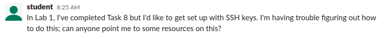
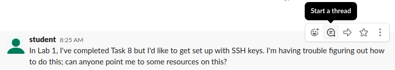
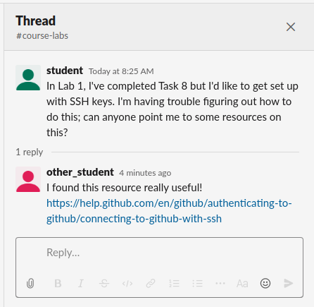
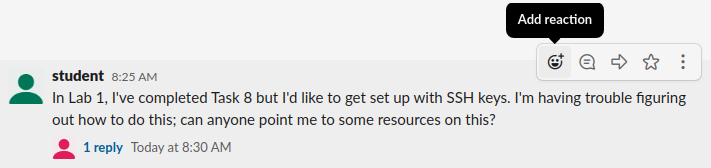
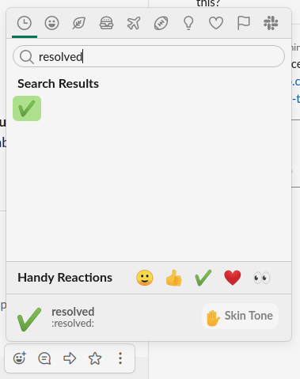

Getting Help on the Homework Assignments
========================================

If you have any questions or get stuck on the homework assignments, there are
two ways of getting help:

Slack
~~~~~

We have a ``#course-homework`` channel on our Slack workspace that can be
used to ask questions about the homework assignments. However, to keep that
channel tidy we ask that you follow a couple of conventions in this
channel.

The most important convention is that there should be one “thread” per
question. In Slack, you can reply to a message, creating a thread of
replies under that message. This makes it easier to keep track of what
messages are replying to a specific question (without threading, things
can get messy if there are a lot of questions being asked at the same
time).

So, if you wanted to ask a question, you would just post your question
on the ``#course-homework`` channel:

Let’s say that question was actually asked by someone else, and you
wanted to reply to it. You must do so by starting a thread:

You will be able to write a reply and, once you post it, it will appear
under the original question:

.. figure:: question-3.png
   :alt: Slack thread

If you want to see the replies in an existing thread, you just need to
click on the reply link (in the above example, you would click on “1
reply” and that would show you the existing replies, and will also allow
you to provide your own reply). This will show you the replies, and will
also allow you to write an additional reply:

If you asked the original question, it’s important for the course staff
to know when your question has been answered to your satisfaction. If
you feel your question has been resolved, you should add the “resolved”
reaction to it. You can do this by clicking on “Add reaction”:

And selecting the “resolved” emoji (note: this is an alias for the
“heavy_check_mark” emoji; you can use that one as well)

Note: An instructor or TA may also use the resolved emoji if they feel
like the question has been resolved but, if it hasn’t, you should feel
free to remove the reaction, and post a reply on the thread to clarify
that you still need assistance with that question.

You can read more about Slack threads
`here <https://slack.com/help/articles/115000769927-Use-threads-to-organize-discussions->`__.

Zoom Office Hours
~~~~~~~~~~~~~~~~~

You can also obtain one-on-one help via Zoom during scheduled office
hours. To “attend” office hours, you must go into the
``#course-office-hours`` channel on Slack whenever office hours are in
session (the times for office hours will be posted in a pinned message
on that channel). Once you’re in the channel, post a message with a
brief description of your issue, and a Zoom meeting ID (this can be your
personal meeting ID, or one created specifically for office hours). The
instructor or TA running office hours will go through these messages,
and visit each meeting to provide one-on-one help.

Note: If you are uncomfortable sharing a meeting ID on the channel,
simply specify that you would like the instructor/TA to send you a
private message once they’re reading to see you, so you can then share a
meeting ID with them privately.

When an instructor or TA joins your meeting, please share your screen
with them if your question is going to involve looking at code or
debugging of any sort (if you prefer, you can also share a single
window, such as your code editor or a terminal). This is similar to how
you would show an instructor/TA your laptop during normal office hours.
During office hours, you may be asked to grant control to the
instructor/TA over your screen. This can sometimes allow us to help you
more interactively (similar to how an instructor/TA would type on your
laptop in normal office hours), but please let us know if you would
prefer not to do this.
