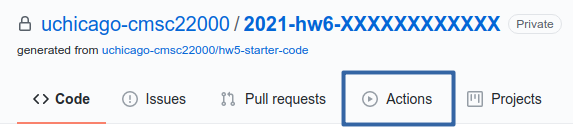
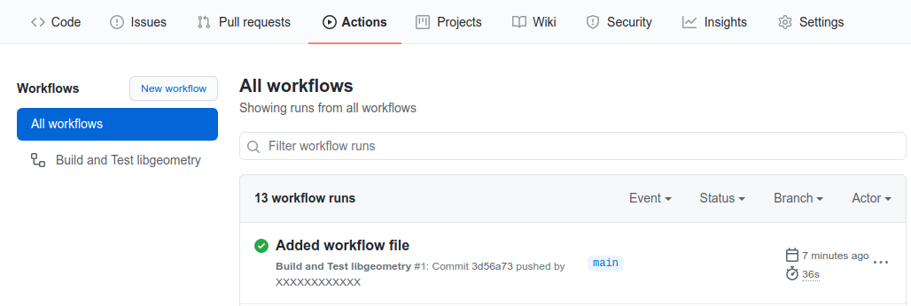
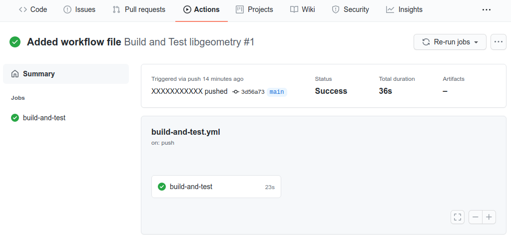
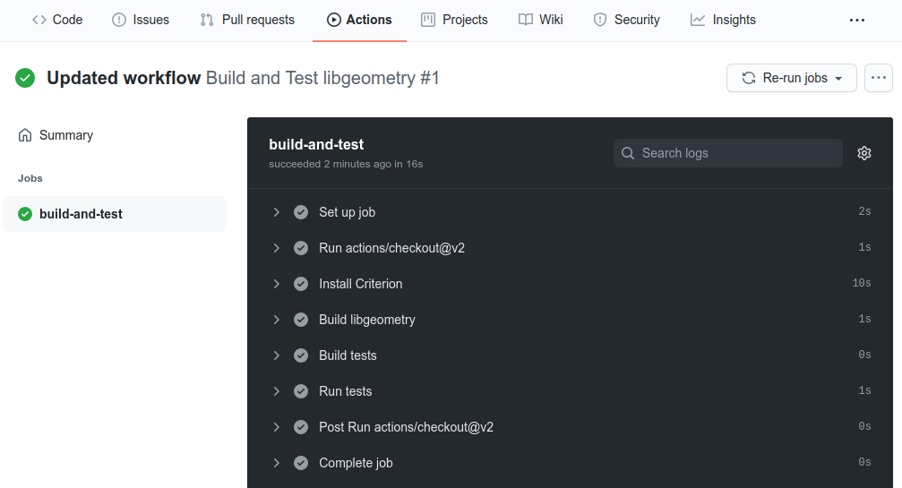
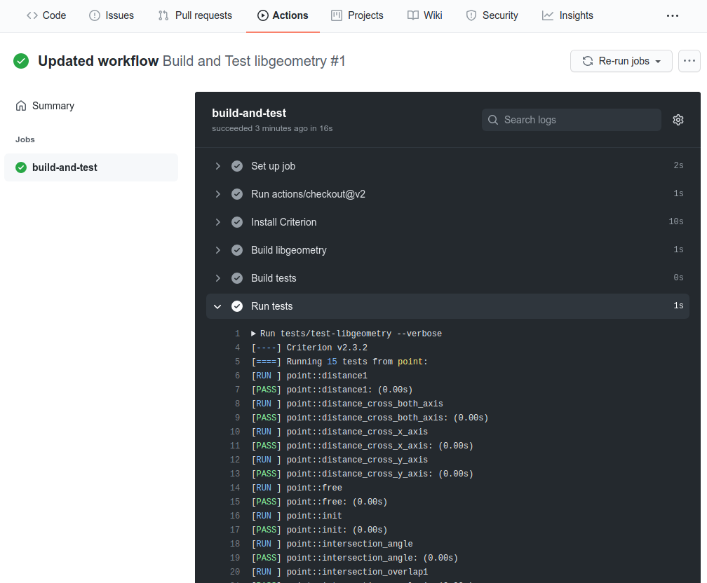
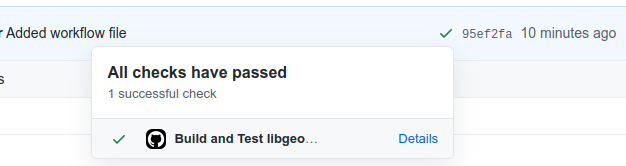

Homework 6: Continuous Integration
==================================

**Due:** Wednesday, May 12, 8pm CDT

Continuous Integration, or CI, is the practice of frequently merging
developers’ work into a mainline branch in a version control system like
Git. CI almost always involves running an extensive set of test cases
every time such a merge happens, or even every time new code is
committed to the repository (not just on the mainline branch, but also
on other branches). Thus many version control systems facilitate CI by
providing mechanisms to trigger certain actions when code is pushed to a
repository.

In this homework, we are going to explore the CI features available through
`GitHub Actions <https://docs.github.com/en/actions>`__, a mechanism
provided by GitHub that allows you to run a series of actions whenever you push new
code to your repository, and which can be used to implement continuous integration
in a repository.

Creating your homework repository
---------------------------------

Like previous homeworks, we will provide you with an *invitation URL* that
will allow you sign up for the homework assignment on GitHub, and which will
result in the creation of a repository called
``2021-hw6-GITHUB_USERNAME`` inside our ``uchicago-cmsc22000`` organization
on GitHub.

Your repository will be seeded with some files for the homework
and, more specifically, will contain the same files we provided for Homework
#5 (an implementation of libgeometry).

Task 1: Building your code with CI
----------------------------------

In most CI systems, we will want to specify a series of actions that
need to happen automatically whenever any commits are pushed to the
repository. For example, we may need to build the code in our
repository, and run some tests. These actions are typically referred to
as *jobs*. A CI system will keep a record of all the jobs it runs, and
will typically notify you if a job fails.

GitHub Actions groups jobs into "workflows", and it is possible to specify
multiple workflows for the same repository. For example, we could have
one workflow to build our code, and another workflow to generate an
installable package for our software.

Workflows are specified using the YAML file format, a text-based
file format that is commonly used for configuration files (fun fact:
YAML is a recursive acronym that stands for “YAML Ain’t Markup Language”). We’ll be
showing some of the basic syntax you need in this homework, but you do not
need to know YAML in depth to be able to write workflow configuration
files in YAML.

We’ll start by looking at a simple GitHub Actions workflow file:

::

    name: Build and Test libgeometry

    on: [push]

    jobs:
      build-and-test:

        runs-on: ubuntu-16.04

        steps:
        - uses: actions/checkout@v2

        - name: Install Criterion
          run: |
           sudo add-apt-repository -y ppa:snaipewastaken/ppa
           sudo apt update -q
           sudo apt install -qy criterion criterion-dev

        - name: Build libgeometry
          working-directory: libgeometry/
          run: |
            make clean
            make all

        - name: Build tests
          working-directory: libgeometry/
          run: make tests

        - name: Run tests
          working-directory: libgeometry/
          run: tests/test-libgeometry --verbose

Create a ``.github`` directory in your repository, and a ``workflows`` directory inside
that directory. Save the above file as ``.github/workflows/build-and-test.yml`` ,
but don’t push it just yet.

.. note::

    Files and directories that start with a period, like ``.github``, are
    hidden by default on a UNIX system. This means the file won’t appear if
    you use ``ls`` from the terminal; you will need to include the ``-a``
    option to be able to see it (i.e., ``ls -a`` instead of ``ls``, and
    ``ls -al`` instead of ``ls -l``). If you are using a graphical file
    browser, you may need to select a “Show Hidden Files” option somewhere
    to be able to see the file.

Let's take a look at what the contents of this file mean. The file
starts with two general configuration options:

-  ``name: Build and Test libgeometry`` specifies a name for the workflow.
-  ``on: [push]`` specifies that the workflow should be run whenever we
   push to the repository. The ``on`` option can be used to specify more
   fine-grained events (e.g., we could specify a workflow that only runs
   when we push to a specific branch)

After that, we have a ``jobs:`` option where we can specify the jobs
that make up this workflow. In this workflow, we are only specifying
a single job called ``build-and-test``.

The first option of the job (``runs-on: ubuntu-16.04``) specifies
that the job should be run on an Ubuntu 16.04 environment. We can't specify
arbitrary environments here, though; a CI system will typically
have a limited set of environments they support (for GitHub Actions,
you can see the list of supported environments
`here <https://docs.github.com/en/actions/using-github-hosted-runners/about-github-hosted-runners#supported-runners-and-hardware-resources>`__)

Next, the ``steps`` option specifies the exact steps that should
be performed as part of this job. You'll notice that all of them,
except the first one, have two options in common: ``name`` and ``run``.
Those steps specify the commands that have to be run as part of the
workflow (notice how these are just commands that you would run
from the terminal if you were building the code manually). Some
of these steps also have a ``working-directory`` option, which
specifies the directory the commands have to be run from.

The first step is different. GitHub Actions actually allows developers to
publish actions that other developers
can re-use in their workflows, and we are reusing an action provided
by GitHub: the ``actions/checkout@v2`` action. This action simply
clones our repository before running the rest of the commands
in the job.

Let's take a closer look at what the other steps do.

First of all, libgeometry uses the Criterion library to run unit tests, so
we need to install that library before building our code.
The following step uses Ubuntu's ``apt`` command to install Criterion:

::

        - name: Install Criterion
          run: |
           sudo add-apt-repository -y ppa:snaipewastaken/ppa
           sudo apt update -q
           sudo apt install -qy criterion criterion-dev

Next, we actually build libgeometry. Notice how we run ``make clean``
first: this is considered good practice, because it ensures our build
starts from a clean slate, in case we inadvertently committed any binary
files to our repository that would interfere with the build.

::

        - name: Build libgeometry
          working-directory: libgeometry/
          run: |
            make clean
            make all

As a separate step, we build the tests. It is also good to place this in
its own step so that, if building the library or the tests fails,
we can easily distinguish which one failed just by seeing what step
of the job failed.

::

        - name: Build tests
          working-directory: libgeometry/
          run: make tests

Finally, we run the tests:

::

        - name: Run tests
          working-directory: libgeometry/
          run: tests/test-libgeometry --verbose

Take into account that we could’ve also run all the commands inside a single
``run`` step:
``script`` phase:

::

    name: Build and Test libgeometry

    on: [push]

    jobs:
      build-and-test:

        runs-on: ubuntu-16.04

        steps:
        - uses: actions/checkout@v2

        - name: Build and Test
          working-directory: libgeometry/
          run: |
            sudo add-apt-repository -y ppa:snaipewastaken/ppa
            sudo apt update -q
            sudo apt install -qy criterion criterion-dev
            make clean
            make all
            make tests
            tests/test-libgeometry --verbose

However, it is considered good practice to separate these commands into
separate steps. In more complex builds, it can be useful to
know exactly what step of a given job failed.

.. note::

    You can find more information about GitHub Actions in the `GitHub Actions
    Documentation <https://docs.github.com/en/actions>`__, and a specification of
    their worflow file format in the `Workflow syntax for GitHub Actions <https://docs.github.com/en/actions/reference/workflow-syntax-for-github-actions>`__ page.
    You don’t need to refer to
    these resources right now, but may need to consult them later in the
    homework.

Go ahead and push the commit you created previously. GitHub will
detect that your repository has a workflow file and
will run the job specified in that workflow.
You can see the status of the workflow by clicking on the
Actions tab of your repository:

You should see something like this:

.. note::

    If you see a yellow icon next to your workflow, that means the workflow is still running.
    It should not take more than a few minutes to complete.

Each row corresponds to an individual *run* of a workflow (identified by the commit
that triggered that run). As you push more commits
to your repository, you'll see more entries in this table.

If you click on the commit name, you'll see more details about the workflow's
jobs (in this case, we only have one job, ``build-and-test``):

Make a note of the URL of this page, which should look something like this:

::

   https://github.com/uchicago-cmsc22000/2021-hw6-GITHUB_USERNAME/actions/runs/XXXXXXXXXX

Where ``XXXXXXXXXX`` will be a number. Later in the homework, we will be asking you
to provide this URL, as well as the
URLs of future runs. To double-check that you're providing the right URL, make sure
that it looks like the one above.

If we click on the ``build-and-test`` job, we can see more details on that job,
including the list of steps that were run in that job:

And, if we click on an individual step, we can see the output of any commands
run in that step.

.. note::

   If a workflow is running (and not completed), you can still navigate to these
   pages to observe the execution of the various steps.

Take into account that you can also access your latest workflow run (even if
it’s in progress) through the main page of your GitHub repository.
In your repository, there will be a
small icon (a green check mark for a successful run, a yellow circle
for a run in progress, and a red X for a failed run) in the top
right of your list of files. If you click on it, it will show more
information about the run:

If you click on “Details”, it will take you directly to the page with
more details about that particular run.

Now, do the following:

-  [10 points] Take the URL of the run you just produced, and paste it
   into Gradescope (under “Task 1: Successful run”)

-  [10 points] Make a change to the libgeometry code that will prevent
   it from compiling. Commit and push that change; your run should
   eventually fail (make sure to double-check that the "Build libgeometry"
   step is failing). Paste the URL of the failed run on Gradescope
   (under “Task 1: Failed run (compiling)”)

-  [10 points] Fix the change you made, and make another change that
   will make the tests fail. Commit and push that change; your run
   should eventually fail (make sure to double-check that the "Run tests"
   step is failing). Paste the URL of the failed run on
   Gradescope (under “Task 1: Failed run (tests)”)

Before moving on to the next task, make sure to fix the change you just
made. Your build should succeed before moving on to the next tasks.

Task 2: Multiple jobs
---------------------

In the previous task we saw that GitHub Actions can build our code and run
the tests, and alert us to any issues when doing so. However, our job
was running specifically in an Ubuntu 16.04 environment. What if our
code doesn’t compile in other environments? CI systems can also help us
with this, as they often provide mechanisms to easily build our code in
multiple environments. For example, we may want to build our code in
multiple Ubuntu versions, or using different compilers.

In GitHub Actions, we can do this by specifying a *matrix* of job
configurations. For example, add this option to your ``build-and-test``
job:

::

    strategy:
      matrix:
        os: [ubuntu-16.04, ubuntu-18.04]
        compiler: [gcc, clang]

Commit and push this change. You'll notice that your workflow now
produces four jobs, corresponding to every combination of the ``os``
and ``compiler`` values shown above.

However, the ``matrix`` option above doesn't actually affect the
running environment or compiler used in the jobs (for example,
if you click through the details of the Ubuntu 18.04 clang job,
you'll see that Ubuntu 16.04 still appears in the "Set up job"
step, under "Operating System", and that the build steps still use GCC).

The ``matrix`` option simply defines variables we can use in our
workflow file, and which get substituted for each individual job.
In this case, the variables are ``${{ matrix.os }}`` and ``${{ matrix.compiler }}``.
So, if we replace this::

    runs-on: ubuntu-16.04

With this::

    runs-on: ${{ matrix.os }}

Each run will use the appropriate operating system. Give it a try!

-  [10 points] Take the URL of the run you just produced, and paste it
   into Gradescope (under “Task 2.1: Multiple operating systems”).

However, our builds are still using GCC in every job. Unfortunately,
the workflow file doesn't have a convenient "tell Make to use this compiler"
option, so this requires a bit more work.

First of all, we will need to modify our Makefile. Notice how the
``libgeometry/Makefile`` and ``libgeometry/tests/Makefile`` files
hardcode ``gcc`` as the compiler::

    CC = gcc

Simply remove this line from both Makefiles, and try running the
following from inside the ``libgeometry`` directory::

    $ CC=clang make

``CC=clang`` defines an *environment variable* that is passed along
to `make` (this is not a Make-specific feature; many UNIX commands
will check the values of certain environment variables).

Notice how you will still be able to run ``make`` without the ``CC``
environment variable::

    $ make clean
    $ make

This is because, if you do not define ``CC`` in the Makefile,
Make will simply use a default value.

Finally, take into account that you could also do something like this::

    $ export CC=clang
    $ make

The difference is that using ``export`` sets the value of the ``CC``
variable for all subsequent commands, while ``CC=clang make``
only sets it for that specific command that is being run (``make``).

Your task is to figure out how to specify environment variables as part
of a workflow job. Remember that you can find the workflow format
documentation `here <https://docs.github.com/en/actions/reference/workflow-syntax-for-github-actions>`__
and that you're welcome to look for the answer through external
sources, as long as you cite your sources.

-  [10 points] Modify the Makefile as described above, and update
   your workflow file so that the libgeometry code and the tests
   are built with the right compiler. Take the URL of the run
   you just produced, and paste it
   into Gradescope (under “Task 2.2: Multiple compilers”).

Task 3: Supporting Different Environments
-----------------------------------------

You may have noticed that Ubuntu 20.04 (the latest "Long Term Support"
version of Ubuntu) was conspicuously missing from the list of operating
systems we were building libgeometry in. This is because the Criterion
library does not provide installable packages for Ubuntu 20.04, which
means the "Install Criterion" step we defined (which uses Ubuntu's ``apt`` command to fetch
and install the Criterion package) will fail on Ubuntu 20.04.

You can give it a try by changing this::

        os: [ubuntu-16.04, ubuntu-18.04]

To this::

        os: [ubuntu-16.04, ubuntu-20.04]

You'll notice that the "Install Criterion" step fails for the Ubuntu 20.04 runs.

Fortunately, we can just build Criterion from its source code.
However, we'd like to do this *only* when building our code
for Ubuntu 20.04 (building Criterion from scratch takes longer
than installing a package, so we'd like to continue to use
the installable packages whenever possible).

So, we're going to end up with two possible installation steps
for Criterion::

    - name: Install Criterion (Ubuntu < 20.04)
      run: |
       sudo add-apt-repository -y ppa:snaipewastaken/ppa
       sudo apt update -q
       sudo apt install -qy criterion criterion-dev

    - name: Install Criterion (Ubuntu >= 20.04)
      run: |
        git clone --recursive https://github.com/Snaipe/Criterion
        cd Criterion
        git checkout master
        cmake -DCMAKE_INSTALL_PREFIX:PATH=/usr -B build/
        make -C build/
        sudo make -C build/ install

Your task is to figure out how to ensure that the first step is only
run if the operating system is ``ubuntu-16.04``, and the second
step is only run if the operating system is ``ubuntu-20.04``.
Note: you must do this without modifying the ``run`` option.
Like before, remember that you can find the workflow format
documentation `here <https://docs.github.com/en/actions/reference/workflow-syntax-for-github-actions>`__
and that you're welcome to look for the answer through external
sources, as long as you cite your sources.

-  [10 points] Take the URL of the run you just produced, and paste it
   into Gradescope (under “Task 3: Supporting Different Environments”).

Task 4: Tweaking the Matrix
---------------------------

One of the advantages of specifying a matrix of configurations is that
it can allow us to very easily verify that our code works across
multiple combinations of different options. For example, let's
say we defined the following matrix::

    strategy:
      matrix:
        os: [ubuntu-16.04, ubuntu-18.04, ubuntu-20.04]
        compiler: [gcc, clang]

This would run six different configurations. However, let's say
we're only interested in testing our code with both GCC and clang
in the latest version of Ubuntu (for prior versions, we'll just
test it with GCC). So, for avoidance of doubt, you would end
up with four jobs:

- Ubuntu 16.04 with GCC
- Ubuntu 18.04 with GCC
- Ubuntu 20.04 with GCC
- Ubuntu 20.04 with clang

Figure out a way to run only the above jobs. For full credit,
you must do so in a way that does not involve writing out the configuration
for four separate jobs. Also, take into account that, depending on
how you solved Task 3, you may have to further tweak your
Task 3 solution to get it to work with all these configurations.

-  [10 points] Take the URL of the run you just produced, and paste it
   into Gradescope (under “Task 4: Tweaking the Matrix”).

Submitting your homework
========================

Please note that you will not be submitting your code through
Gradescope. Instead, make sure that you have provided the URLs to your
runs through Gradescope. That said, we still need you to push your
code in case we need to look at any of your code (but we will not be
grading the code itself).
