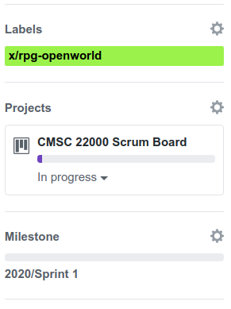

Issue/PR Grading
=================

The "Project Points" component of your `grade <../grading.html>`__
will be based on how well
you perform certain tasks that you will do throughout the project (and
which you would encounter in any real software project). More specifically,
each issue and pull request will be scored using the ESNU scale and you will accrue
a certain number of points for a completed issue or pull request
as long as you earn, at least, an S.

In this page, we first describe the high-level requirements for
issues and pull requests, and then provide the detailed rubric we
will use (and how it translates into a specific amount of points).

Requirements for Issues
-----------------------

We will be using GitHub Issues to keep track of tasks in each sprint.
After the team meeting at the start of a sprint, you must create
GitHub issues for the tasks you are committing to doing (these can
start out as "notes" on the project board, but must be converted
to issues shortly afterward).

An issue must include the following:

-  A descriptive title
-  A descriptive summary
-  Updates on the progress of the task
-  A closing statement

We describe each of these in more detail in the sections below.

Additionally, when creating an issue, you must take care to fill in the
following fields:

-  **Assignees**: Anyone who will be working on the issue must be added
   here.
-  **Labels**: You must select, at least, the label corresponding to
   your team (the team labels start with ``x/``). *Do not* select labels
   for other teams, even if your work is related to that team. If
   someone from another team is contributing substantially to the issue,
   then they should be added as an Assignee.

   You may also select any number of generic labels that describe the
   nature of the issue (“bug”, “enhancement”, etc.). *Do not* create new
   labels without first checking with an instructor/TA.
-  **Projects**: Make sure that the issue is part of the “CMSC 22000
   Scrum Board”.
-  **Milestone**: Select the sprint this issue is a part of.

For example, this is what the labels, projects, and milestones field
could look like:

   GitHub Issue

Descriptive title
~~~~~~~~~~~~~~~~~

The title should be a single sentence summarizing what will be done in
this task.

For example:

1. “Design and implement a `Circle` class”
2. “Add support for higher-dimensional points”
3. “Research libraries for drawing simple geometric shapes”
4. “Fix bug in segment intersection when segments overlap perfectly”

We will be referring back to the above four tasks in other examples, and
we will refer to them as “Task #1”, “Task #2”, etc.

For example, here are less-descriptive titles for the above four tasks:

-  Task #1: “Work on `Circle` class” (what work is being done on the
   class?)
-  Task #2: “Higher-dimensional points” (not a complete sentence, not
   clear what you’ll be doing)
-  Task #3: “We need drawing libraries” (that’s true, but what is being
   done about it in this task?)
-  Task #4: “Fix bug” (what bug is being fixed?)

Descriptive Summary
~~~~~~~~~~~~~~~~~~~

A descriptive summary of what the task involves. One thing that must be
clear from this summary is how you will know whether the task is done.
Sometimes this is self-explanatory (e.g., if you are fixing a bug, the
task is done when the bug is fixed), but in other cases you should avoid
being too open-ended (e.g., when would you know whether you’re done
“researching libraries”?) It can also be useful to provide context for
why this task has been created.

When a task refers to a bug, the summary should include concrete
instructions for reproducing the bug, including the full and unabridged
output of the steps that lead to the bug manifesting itself.

Here are some examples of descriptive summaries:

**Task #1**

   libgeometry currently lacks a way to work with circles. We need to
   design and implement a `Circle` class with methods to compute
   the circle's area and diameter, as well as intersections between circles.

**Task #2**

   libgeometry only supports points in two-dimensional space. We should
   generalize this design to support points in any dimensions, by having
   the ``Point`` class look like this:

   ::

      class Point:
          def __init__(self, vals: List[float]):
              self._ndims = len(vals)
              self._vals = vals[:]

   The `Segment` and `Polygon` classes will need to be updated to use this
   new class, and their tests will need to be updated. We also need to
   add additional tests for segments and polygons in, at least,
   three-dimensional space.

**Task #3**

   We would like to eventually be able to visualize points, segments,
   and polygons. Before doing this, we should pick a library that easily
   allows us to do this. We should find at least three alternatives, and
   then discuss which one we prefer. If you would like to suggest a
   library, please make sure to include a link to their documentation,
   as well as (if possible) a link to code samples for that library.

**Task #4**

   Computing the intersection of identical segments makes
   ``Segment.intersects`` return None, instead of True or False.
   You can reproduce this by running this code:

   ::

      p1 = Point([2.0, 3.0])
      p2 = Point([5.0, 7.0])

      s1 = Segment(p1, p2)
      s2 = Segment(p1, p2)

      print(s1.intersects(s2))

And here are example of summaries that would be less helpful:

**Task #1**

   I’m going to add a circle class

It’s not clear why we’re doing this, or how we’ll know when this task is
done.

**Task #2**

   Turn x, y in Point into a list. Make sure it doesn’t break any
   other code.

While this describes what will be done in the task and how we’ll know
when it’s done (when any code we break by the update to `Point` is
fixed), this needs to be more concrete.

**Task #3**

   Ok, so maybe we want to actually draw the points and segments and
   polygons at some point??? (lol point) Are? There? Libraries? For?
   This? Maybe someone can look them up? 🤔

Task descriptions should be concise and to the point. Jokes and colorful
writing styles can distract from this.

**Task #4**

   If I create two identical segments and check if they intersect, I
   get the wrong return value.

While this provides some indication of what needs to happen for the bug
to manifest itself, the summary should provide concise instructions on
how to reproduce the issue. At the very least, the code for reproducing
the problem should be included in the issue.

Updates on the progress of the task
~~~~~~~~~~~~~~~~~~~~~~~~~~~~~~~~~~~

If you make any intermediate progress before finishing the task,
specially if you have pushed any code related to this task, then it
should be documented on the GitHub issue. For example:

-  In Task #1, suppose you implement a barebones `Circle` class with
   a constructor but no other methods. You could commit and push that
   code, and post a comment in the issue.
-  In Task #3, you could post a comment every time you finish reviewing
   an individual library (instead of just posting everything together at
   the end)

Pro tip: If you include an issue number in a commit message, then it
will appear automatically in that issue, which will make it easier to
keep track of what commits are associated with a given issue.

Note: Some tasks may simply not lend themselves to reporting any
intermediate progress, in which case the closing statement (described
next) would be enough.

Closing statement
~~~~~~~~~~~~~~~~~

When a task is done, you should close the corresponding GitHub issue,
and you should include a comment explaining why this task is done. In
some cases, this is as simple as stating that the work has been done.
For example, in Task #1 you could simply state “Implemented the `Circle`
class, including the area, perimeter, and intersection methods”.

This may seem redundant, but take into account that closing an issue may
not necessarily mean that the task is done. For example, the following
could also be valid closing statements for Task #1:

-  “We ultimately decided we don’t need a `Circle` class after all. I’m
   closing this issue, but will reopen if we decide to revisit this”
-  “The `Circle` class has been implemented, except for the intersection
   method, which turned out to be more complex than anticipated. I am
   closing this issue, and have created a separate task (#5) for
   implementing circle intersections”

If multiple developers are assigned to the issue, the closing statement
must also include a clear statement of what work was done by each
developer

Requirements for Pull Requests
------------------------------

As in many software projects, the ``main`` branch of our Git
repository should only contain stable code that compiles, runs, and
passes all tests. This is enforced by making the main branch a
*protected* branch, meaning that only the instructors and TAs have the
ability to directly push to that branch.

On top of that, there is an additional ``dev`` (short for “development”)
branch that acts as a “pre-main” branch. The ``dev`` branch is also
protected, and should only contain stable code, but it is used as a
staging area to integrate code (and uncover potential integration
issues) before publishing code to ``main``.

This means that, to get code into ChiGame, you must make pull request
to get code merged into the ``dev`` branch (and the instructor and TAs
will decide when to merge that code into ``main``).

Because the ``dev`` branch should contain stable code, pull requests to
``dev`` must be carefully reviewed before they are approved. If you want
to merge code into ``dev``, your code must be reviewed by (1) someone in
your team and (2) your senior developer. Please note that the senior
developer will only do their code review once your teammate has completed
their review. Additionally, when your code affects code
owned by another team, you must have an additional reviewer from each
team whose code is affected.

A pull request should contain a relatively self-contained piece of work.
In fact, it is not uncommon for a task (or, at most, 2-3 tasks) to
result in a pull request. We encourage you to touch base with your
senior developer before creating your first pull requests, to determine
whether the work you want to merge merits a pull request (or, similarly,
whether it needs to be broken up into multiple pull requests).

Like a task, a pull request should have a descriptive title, a
descriptive summary, updates on the progress of the pull request
(especially since changes may need to be done based on the code
reviews), and a closing statement. The assignees for the pull request
must be everyone who contributed to the code that is being merged.

Before a pull request is approved, the merge being merged must be
"up to date" with ``dev``, meaning that any changes that happened
in ``dev`` while the pull request was being reviewed must be merged
into the pull request's branch. It is sometimes not uncommon for
a pull request to take a few days to get approved (because the review
takes a while, or because you realize there are more changes you need to
make in that pull request); when that happens, you want to get into
the habit of merging from ``dev`` frequently, and not just right before
the pull request is approved.

Finally, take into account that the final outcome of a pull request could be for
that pull request to be denied. If this happens, it will not impact your
score (the effect will be the same as if you had never made the pull
request to begin with).

Grading
-------

Each issue and pull request will be scored on the ESNU scale
(following the rubric we describe further below). Additionally,
an issue or a pull request may be determined to be a "minor"
issue or pull request (e.g., if you create a pull request to fix
a small bug that only requires changing a few lines of code).

Based on this, you will receive the following number of points
for a completed issue or pull request:

.. cssclass:: table-bordered

+---+-----------------+-----------------+
|   | Issue           | Pull Request    |
+---+---------+-------+---------+-------+
|   | Regular | Minor | Regular | Minor |
+---+---------+-------+---------+-------+
| E | 10      | 2     | 20      | 4     |
+---+---------+-------+---------+-------+
| S | 5       | 1     | 10      | 2     |
+---+---------+-------+---------+-------+

Please note that earning an N or U does not accrue points.

On an issue, all assignees will receive the same amount of points
for a completed issue. If a pull request is approved, all assignees
*and* reviewers will receive the points for that pull request.

That said, if an issue/PR has four or more people assigned
to it (not including PR reviewers), you will only receive 70% of the points stated above.

Regular vs Minor issues
~~~~~~~~~~~~~~~~~~~~~~~

When deciding whether to categorize an issue/PR as being a "minor" issue/PR, the senior developer will base their determination
on the amount of effort that the issue/PR likely involved. These are examples of issues/PRs that would be categorized as "minor":

- Small bug fixes
- Trivial changes, even if they affect a large number of lines (e.g., adding a new parameter in all calls to a function)
- Minor documentation changes (typos, etc.)

Please note that it is possible for an issue to be categorized as a regular issue, but have an associated pull request that is categorized as "minor". For example, an issue could relate to a bug in the code, and it may be clear from the status updates that tracking down
that bug required a fair amount of effort. However, if the actual fix just involves changing one line of code (e.g., because
you forgot to ``malloc`` memory somewhere), the pull request would be categorized as "minor".

If you are ever concerned that an issue or PR you are working on could be categorized as "minor", please check with your senior
developer. The intent is that only issues/PRs that truly involved a minor effort on the part of the student will be
categorized as "minor".

Delaying/Splitting Tasks
~~~~~~~~~~~~~~~~~~~~~~~~

As you will find out throughout the project, estimating the time a task
will require can be challenging. You could commit to doing a task
thinking it will only take 1-2 hours, and then find that it is actually
a 3-5 hour task. So, you are allowed to do the following:

-  For tasks that you committed to doing, you are allowed to reassign a
   task to a future sprint, or place it back into the backlog.
   However, if a task gets delayed before it is completed, it may
   affect your score on that task (we elaborate on this in the
   rubric below)
-  | For any task, if you realize that it will take longer than you
     anticipated, you are allowed to close the task and spawn smaller
     tasks in its place. The closed task will then not contribute to
     your individual score.

   Note: The rules are stricter for tasks you have committed to doing.
   You will need the senior developer’s approval to split such a task
   (we will likely approve most reasonable splits, but want to avoid
   anyone arbitrarily splitting a task into many microtasks just to rack
   up points). You will also not be allowed to split them after a
   certain point. In 1-week sprints, you cannot split tasks after
   Thursday. For 2-week sprints, you cannot split tasks after Monday of
   the second week of the sprint. When you split a task you committed to
   doing, you must commit to doing at least one of the subtasks; the
   remaining subtasks can go on the backlog (and you could commit to
   doing them in a subsequent sprint).

Rubric
------

When grading your issues/PRs, the graders will use the rubric items
listed below (note that some of them are labelled as "[Major]" and will
have a larger impact on your score). Your ESNU score on the issue/PR
will be determined as follows:

- **Excellent**: At most one minor issue.
- **Satisfactory**: At most three minor issues or, alternatively, at most
  one major issue with at most one minor issue.
- **Needs Improvement**: Does not meet the requirements for an E or S.
- **Unsatisfactory**: This score is reserved for issues/PRs that are effectively
  blank, or that need to be excluded from grading for some reason (e.g.,
  if the issue was created in error)

Rubric items
~~~~~~~~~~~~

When reading the rubric items below, bear in mind that they can all apply to either an issue or a pull request
(except when the rubric item clearly refers to a PR-specific aspect).

- **Title does not convey a clear and tangible goal**: The title of an issue has to convey what the issue will be producing. In the future, try using simple titles with a "Verb-Object" structure that clearly states what you will be doing in the issue (e.g., “Design and implement a ‘Circle’ class”, “Research libraries for drawing simple geometric shapes”, etc.)
- **The title is too generic and could relate to other teams**: Even though you can add labels to issues to categorize them, you should avoid titles that could plausibly apply to multiple teams
- **There is no summary, or it is just a "Name:" and "Team:" from a Scrum board card.**: The issue did not include a descriptive summary (see `Descriptive Summary <#descriptive-summary>`__ above for more details and concrete examples)
- **The summary is too terse, and likely wasn't fleshed out from what was written on the Scrum board card.**: The summary for this issue is too terse. A good rule of thumb is that you should be writing at least one full paragraph in your summary (see `Descriptive Summary <#descriptive-summary>`__ above for examples). If this issue was generated from a Scrum board card, please remember that the summary you write in the Sprint meeting is meant to be a quick draft; it needs to be fleshed out when you convert the card to an issue.
- **The issue summary doesn't convey a clear goal**: An issue should have the goal of producing something tangible, such as code or documentation, which must be specified in the summary.
- [Major] **No status updates**: Your issue did not include any status updates between the opening of the issue and the closing of the issue (and this issue was not small enough to justify having no status updates at all). If you make any intermediate progress before finishing the task, then it should be documented on the GitHub issue via a comment.
- **Too few status updates (for a large task)**: For a task of this size, we would've expected to see more status updates and/or status updates that were more detailed.
- **Updates refer to intangible work**: Status updates on an issue should have something tangible to share.
- **One or more updates are unrelated to the issue**: Make sure not to "hijack" an issue with an unrelated issue. This is often the sign that a new issue needs to be created (or, at least, that the conversation has to be moved elsewhere)
- **Update refers to meetings or discussions, but the outcome of those meetings are not documented.**: If, as part of an issue, you have a meeting or conversation with other developers, make sure to include a summary of that conversation, with an emphasis on any decisions that were made in that conversation. It is not enough to just state that you talked with someone.
- **No closing statement**: When an issue is done, you should include a final comment summarizing what was done, and why the issue is being closed.
- **Did not include assignees**: Make sure to add anyone who is working on this issue as an Assignee
- **Did not include a milestone**: Make sure to assign new issues to the sprint they are worked on (by selecting the appropriate sprint under "Milestone")
- **Did not select a team label**: Make sure to select your team's identifier under "Labels"
- **Scrum board card was converted to an issue too late**: Remember that Scrum board cards should be converted to issues shortly after the Sprint meeting. Think of the Scrum board card as a rough outline of the issue, which you then need to flesh out with a more descriptive title and summary when converting it to an issue.
- **Issue includes links to Google Docs (or other inaccesible documentation)**: While using Google Docs to sketch out some of the documentation, you should avoid posting links to those Google Docs from an issue, as it may cause confusion as to whether that document (or some future update to the wiki) is the most up-to-date version of that documentation. You should instead transfer the contents of the document to the wiki, and then link to the wiki when updating the issue.
- **Issue was closed prematurely**: The issue was closed before it was actually done.
- **Issue spanned two sprints**: The issue was started in one sprint, but was not completed until the next one.
- [Major] **Issue spanned three or more sprints**: The issue was started in one sprint, but was reassigned to a new sprint more than once.
- [Major] **Issue was assigned at the start of the sprint, and was split without the senior developer's approval**: Remember that, if you committed to an issue at the start of the sprint, you need your senior developer's approval to split it into smaller issues.
- [Major] **The student reviewer did not provide any feedback and simply rubberstamped the PR.**: The reviewer for this PR approved the PR without comment. In the rare cases where there truly isn't anything to improve in the PR, make sure to leave a comment confirming that you reviewed the code and don't have any changes to suggest.
- **The student reviewer indicated there was nothing to improve in the PR, but the senior developer identified multiple issues that the student reviewer should have been able to pick up on**: Please make sure that you do a thorough code review and, in the future, make sure to look out for the kind of issues the senior developer pointed out.
- **The PR was created before it was ready for review (the student kept pushing commits after creating the PR, before it had been reviewed)**: When you create a PR, you are requesting a review of the code in the branch you want to merge. As such, you should not push any commits to the branch right after creating the PR; you should only do so in response to a code review. Make sure that, when you create a PR, the code is ready for review and passes all the tests.
- [Major] **The PR contains a hodgepodge of different changes, instead of merging a branch that contains a clearly-specified and self-contained feature/change to the code.**: A branch should represent work on a concrete feature that is being added to the mainline branch, instead of a collection of many different changes.
- [Major] **The PR is either clearly too large (1,000's of lines) or simply could've been broken up into smaller PRs, providing an opportunity to integrate more continuously.**: This PR represents a large amount of work that could've been integrated into ``dev`` through smaller PRs earlier in the quarter. Remember that you should not treat PRs as a singular event to merge all or most of your work into ``dev``. Integrating incrementally can help identify integration issues early, as well as ensure that you are not rushing to merge all your code towards the end of a sprint.
