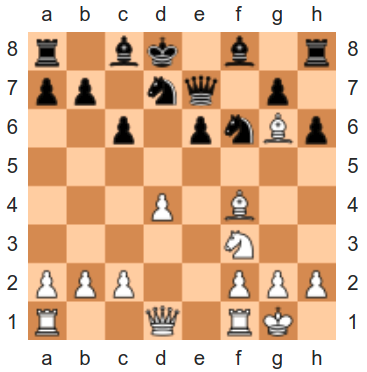

Design Warm-up #1: Boardmaster 3000
===================================

**Due:** Wednesday, April 14th, 8pm

**NOTE:** The late submission policy for homeworks does not apply to this
assignment. We will be discussing this design in class on Friday, April
16th, and need all submissions ready by then.

You have recently joined a software company that is developing an
exciting new game: The Boardmaster 3000! This game will allow users to
play a variety of two-player board games, all of which can be played on
a square `chessboard <https://en.wikipedia.org/wiki/Chessboard>`__ (like
`chess <https://en.wikipedia.org/wiki/Chess>`__,
`checkers <https://en.wikipedia.org/wiki/Draughts>`__, and some
`variants of
chess <https://en.wikipedia.org/wiki/List_of_chess_variants>`__)
However, we are following an incremental software development model, so
we are going to start by supporting only chess. This will give us a
chance to get some initial feedback on the Boardmaster 3000 before we
move on to supporting other games.

What’s that you say? There are a lot of chess games out there already? Ah,
but the Boardmaster 3000 will feature a state-of-the-art multiplatform
VR interface with AI adversaries powered by sophisticated Deep Learning
algorithms! Also, you can bet on games using our own cryptocurrency,
Boardcoin, and sell screenshots of your games as NFTs!

Very exciting stuff... which is in the hands of other teams in the
company. Your team will be focusing on a different task: loading/saving
games from/to disk, and providing an API for manipulating the state of
the game.

The CBF Format
--------------

The Boardmaster 3000 will need to be able to save games to disk (e.g.,
if we want to stop playing, and then resume the game at a later time),
and then load those saved games from disk (additionally, a user may want
to load a famous chess match). We will be using a simple file format
called CBF (ChessBoard File), where the chessboard is represented with
text characters. For example, this chessboard:

   Source: https://en.wikipedia.org/wiki/Deep_Blue_versus_Kasparov,_1997,_Game_6

Would be represented like this:

::

   R_BK_B_R
   PP_NQ_P_
   __P_PNbP
   ________
   ___p_b__
   _____n__
   ppp__ppp
   r__q_rk_

Each line represents a row of the chessboard. Empty spots are
represented by an underscore character, black pieces are represented
with uppercase letters, and white pieces are represented with lowercase
letters:

-  ``p``/``P``: Pawn
-  ``r``/``R``: Rook
-  ``b``/``B``: Bishop
-  ``n``/``N``: Knight
-  ``q``/``Q``: Queen
-  ``k``/``K``: King

Chess rules
-----------

Our first version of the Boardmaster 3000 will only have to support a
subset of the rules of chess. In particular, we will only support the
moves specified in the “Basic moves” section of the `Rules of
chess <https://en.wikipedia.org/wiki/Rules_of_chess#Basic_moves>`__
Wikipedia article. This means we do not yet support castling, *en
passant*, or pawn promotion.

Your task
---------

Broadly speaking, you will be responsible for designing modules for
loading, manipulating, and saving the state of a single game. While this
may not seem terribly exciting in isolation, your modules will be used
by a lot of other teams in the Boardmaster 3000 project. For example,
when our advanced Chess AI, fondly nicknamed “The Chessinator 3000”,
needs to know whether a piece in position (x0, y0) can move to position
(x1, y1), it will be calling your code.

Take into account that you are only going to be *designing* these
modules. So, you will be focusing only on specifying the *interface* of
those modules, and not their implementation (with one exception: you
will have to provide a specification of any internal data structures you
expect to use).

Your modules must provide at least the following functionality:

-  Loading a game from disk
-  Saving a game to disk
-  Determining the following about the state of the game:

   -  What piece (if any) is in position *x, y*?
   -  What are the possible moves for the piece in position *x, y*?
   -  Can piece in position (x0, y0) move to position (x1, y1)?
   -  What piece (if any) will the piece in position (x0, y0) take if it
      moves to position (x1, y1)?
   -  Can the piece in position *x, y* be taken by some other piece in
      one move?
   -  What pieces have been taken by a given player?

-  Changing the state of the game:

   -  Move piece in position (x0, y0) to position (x1, y1), unless it is
      an illegal move.

Hint: A big part of this design will be to figure out how to represent
the state of the game using C structs.

.. _warmup-deliverables:

Deliverables
------------

Instead of preparing a formal document, you will be specifying your
design in C code. For each module you design, you must provide a header
file and a C file. The header file should contain all the functions that
are provided by that module, and the C file should contain empty
implementations of those functions. Each function in the header file
must include code comments explaining the purpose of the function.

For example:

.. code-block:: c

   math.h:

       /* This function adds two numbers */
       int add(int x, int y);

   math.c:

       /* See math.h*/
       int add(int x, int y)
       {
           /* TODO */
           return 0;
       }

You must also provide struct definitions for any data structures you
expect to use in your modules. You must use code comments to provide a
description of the struct, as well as any non-obvious fields.

You may assume that you have the ability to use standard data structures
like linked lists, hash tables, etc. If you need to use such a type, you
can include a forward declaration in lieu of an actual data structure
(i.e., you do not need to design a linked list module or find an
existing one).

For example:

.. code-block:: c

   printer.h:

       /* Forward declaration */
       typedef struct list list_t;

       /* This struct represent a single print job. A print
          job includes some text that needs to be printed out */
       typedef struct printjob
       {
           int identifier;
           char *text;
       } printjob_t;

       /*
       typedef struct printer
       {
           char *name;

           /* Duplex printing: true if printer can do two-sided printing */
           bool duplex;

           /* Print job that is currently being printed (NULL if none) */
           printjob_t *current_job;

           /* List of printjob_t structs. Represents the jobs that
              are waiting to be printed */
           list_t *jobs;
       } printer_t;

We encourage you to follow `this style
guide <https://uchicago-cs.github.io/dev-guide/style_guide.html>`__ when
writing your code, but will not be grading you based on style at this
point. However, we will expect you to follow this style guide in the
project, so familiarizing yourself with it will be good practice.

Please note that your code *must* compile correctly. This will ensure
that you are properly specifying your structs and functions. We will be
talking about building projects with multiple modules during third week
but, in the interim, you can compile your code like this:

::

   gcc file1.c file2.c file3.c main.c -o bm300

Do not name your modules ``file1.c``, ``file2.c``, etc. Instead replace
those filenames with those of your C modules. Please note that, for your
code to compile correctly, you must include a ``main.c`` file with an
empty ``main()`` function (your ``main()`` function does not need to
call any of your functions, etc.). You are welcome to provide a
``Makefile``, but are not required to do so.

Finally, you must include a ``README`` file with a summary of each
module, and any other general notes on your design.

Note: Once the design exercise is done, all the teams will be able to
see each other’s designs (along with the comments we will provide,
except for their score). This will allow you to see how other teams
approached the same design problem, which can be very useful in honing
your own design skills. However, this also means you have to make sure
your code and documentation will be easy to read and understand by
others.

Creating your shared team repository
------------------------------------

Similar to the lab assignments, you will have to follow an *invitation
URL* to create a repository. However, you will now be given a repository
that everyone in your team will have access to. Once you follow the
invitation URL, you will be asked to either select an existing team, or
create a new one. If you don’t see your team listed under “Join an
existing team”, that means you are the first person in your team to
accept the invitation. Simply specify your team’s name under “OR Create
a new team” and click “+ Create team”. Make sure to use a name like "Team A", "Team B", etc.

If you join the wrong team, or mistakenly create a duplicate team,
please notify an instructor/TA.

Submission Instructions
-----------------------

Before submitting, make sure you’ve added, committed, and pushed all
your code to GitHub.

You will submit your code through Gradescope. Please note that only one
team member needs to make the submission (that team member will be given
the option to specify who else is in their team). When submitting, you
will be given the option of manually uploading files, or of uploading a
GitHub repository (we recommend the latter, as this ensures you are
uploading exactly the files that are in your repository). If you upload
your repository, make sure you select your
``2021-design1-team-X`` repository, with “main” as the
branch. Please note that you can submit as many times as you want before
the deadline.

Design Warm-up #2: Boardmaster 3000 (Part II)
=============================================

**Due:** Wednesday, April 21st, 8pm CDT

**NOTE:** The late submission policy for labs does not apply to this
assignment. We will be discussing this design in class on Friday, April
23rd, and need all submissions ready by then.

Good news, everyone! The first version of the Boardmaster 3000 has been
a resounding success! We got a lot of quality feedback from users, which
included comments like “the VR interface is like nothing I’ve seen
before”, “finally, a chess game that challenges both my intellect *and*
my senses”, and “the AI is creepily lifelike, in a good way, I guess”.
We know you were not involved in any of those aspects of the game, but
your modules for loading, manipulating, and saving the state of a game
were an indispensable building block that made the rest of the game
possible.

Encouraged by this early feedback on the first version of the game, we
are going to add more features to the Boardmaster 3000:

-  Support for two more games: checkers and Almost Chess
-  Support for square chessboards larger than 8x8
-  Support for pawn promotion in chess
-  Support for CBFv2, a new and improved file format for specifying
   chessboard-based games

In this design exercise, you will revise your previous design to
accommodate these additional features.

Additional games
----------------

The Boardmaster 3000 must now support
`checkers <https://en.wikipedia.org/wiki/Draughts>`__ (and,
specifically, `International
Checkers <https://en.wikipedia.org/wiki/International_draughts>`__) and
`Almost Chess <https://en.wikipedia.org/wiki/Almost_Chess>`__. Take into
account that, while we are only adding these two games right now, we
anticipate we will likely want to support more games in the future, so
our design should not be specific to just chess, checkers, and Almost
Chess, and should be easily extensible to support other games played on
a square chessboard. For example, it’s likely we will want to support
`Capablanca Chess <https://en.wikipedia.org/wiki/Capablanca_Chess>`__ in
the near future.

International Checkers
~~~~~~~~~~~~~~~~~~~~~~

We will follow the rules described in the `International
draughts <https://en.wikipedia.org/wiki/International_draughts>`__
Wikipedia article. However, it is not our goal to support every possible
rule perfectly in our first implementation of checkers. You may make any
simplifying assumptions you want, as long as you support, at least,
moves by regular and crowned pieces, and single-piece captures. Take
into account this means you don’t have to support capturing multiple
pieces in successive jumps.

Take into account that checkers is played on a 10x10 board, an
additional requirement that is described further below.

Almost Chess
~~~~~~~~~~~~

In `Almost Chess <https://en.wikipedia.org/wiki/Almost_Chess>`__, the
queen piece is replaced with a
`chancellor <https://en.wikipedia.org/wiki/Empress_(chess)>`__ piece,
which can move like a rook or a knight. Other than that, there are no
other changes to the rules.

Larger Chessboards
------------------

In part due to supporting checkers, we now have to be able to support
chessboards larger than 8x8. Besides the 10x10 chessboard, we may want
to also allow for chess to be played in chessboards larger than 8x8. You
may assume that, when using a larger chessboard, the game still starts
with 32 pieces, and that the exact initial arrangement will be an
implementation detail.

Pawn Promotion
--------------

We will now support pawn promotion in chess: when a pawn reaches the
other end of the board, it can be promoted to a queen, rook, bishop, or
knight. We will continue to *not* support castling or *en passant*.

Support for CBFv2
-----------------

The CBF format we used in the first design is insufficient to support
the new features being introduced in this new version of the Boardmaster
3000. Fortunately, there is a more advanced format, CBFv2, we can use.
Here is an example for a chess game:

::

   game: chess
   board-size: 8
   p1-captured: PPNN
   p2-captured: q
   next-turn: p2
   R_BQKB_R
   P____PP_
   __PPP__b
   __p_____
   ________
   n_______
   ppp_pppp
   r___kbnr

Here is an example for a checkers game:

::

   game: checkers
   board-size: 10
   p1-captured: CCC
   p2-captured: c
   next-turn: p1
   _C_C_C_C_C
   C_C_C_C_C_
   ___C_C_C_C
   C_____C___
   _______C__
   __c_______
   _c_____c_c
   c_c_c_c_c_
   _c_c_c_c_c
   c_c_c_c_c_

A few notes:

-  For Almost Chess, the game type is ``almost-chess``
-  The ``captured`` fields refer to the pieces capture *by* that player
   (not *from* that player). Player 1 (``p1``) is whatever player makes
   the first move in the game.
-  In almost chess, a chancellor is represented with ``c``/``C``
-  In checkers, a crowned piece is represented with ``k``/``K``

Your task
---------

You must modify the design you produced in the first design exercise to
support these additional requirements, possibly adding additional
modules. The number of changes required will depend on how
general-purpose you made your first design (so, having to make only a
few small changes is not necessarily a bad thing).

Take into account that the functionality provided by your modules is
still, essentially, the same as before:

-  Loading a game from disk
-  Saving a game to disk
-  Determining the following about the state of the game:

   -  What piece (if any) is in position *x, y*?
   -  What are the possible moves for the piece in position *x, y*?
   -  Can piece in position (x0, y0) move to position (x1, y1)?
   -  What piece (if any) will the piece in position (x0, y0) take if it
      moves to position (x1, y1)
   -  Can the piece in position *x, y* be taken by some other piece in
      one move?
   -  What pieces have been taken by a given player?

-  Changing the state of the game:

   -  Move piece in position (x0, y0) to position (x1, y1), unless it is
      an illegal move.

However, you must take into account the following:

-  Moving a piece could result in the piece changing to a different type
   (e.g., pawn promotion in chess and crowning in checkers). While this
   could be treated as an implementation detail (if you make a move,
   this is just a different way in which the internal state of the game
   changes), your “move” function should supply this information in some
   way (otherwise, the user of your module will have to check the state
   of the piece after every move, to see whether it has changed)
-  Since we expect to support more games in the future, you should avoid
   having a function for moving a chess piece and a function for moving
   a checkers piece. Otherwise, if we end up supporting 50 games, we’ll
   end up with 50 “move” functions! (and similarly with other functions
   in your interface)

Like the previous exercise, remember that you should focus only on
specifying the *interface* of your modules, and not their
implementation. Make sure to review the  :ref:`warmup-deliverables` section of the
first part of the exercise, as your updated
design should follow the same guidelines described there.

Besides the C code that specifies your design, you should also answer
the following questions in your README file:

-  In general, what major changes (if any) did you have to make to your
   design to accommodate the additional requirements?
-  In hindsight, what (if anything) would you have done differently in
   your original design that would’ve made it easier to add support for
   these additional requirements?

Creating your shared team repository
------------------------------------

Like the previous design exercise, you will have to follow an
*invitation URL* to create a repository. However, since the teams were
already created in the previous design exercise, the invitation URL will
show you all the existing teams, and all you need to do is select yours.

If you join the wrong team, or mistakenly create a duplicate team,
please notify an instructor/TA.

Submission Instructions
-----------------------

Before submitting, make sure you’ve added, committed, and pushed all
your code to GitHub.

You will submit your code through Gradescope. Please note that only one
team member needs to make the submission (that team member will be given
the option to specify who else is in their team). When submitting, you
will be given the option of manually uploading files, or of uploading a
GitHub repository (we recommend the latter, as this ensures you are
uploading exactly the files that are in your repository). If you upload
your repository, make sure you select your
``2021-design2-team-X`` repository, with “main” as the
branch. Please note that you can submit as many times as you want before
the deadline.
